# Trabajo Práctico — Arranque de Sistema en STM32 (Bare Metal)

## 1. Objetivo
Se logró comprender los conceptos bases del funcionamiento de los cortex M3 con la intencion de poder entender cómo afectan los archivos startup, linker, y main en la memoria y ejecucion

## 2. Estructura del Proyecto

### Archivos principales

- `startup.c` → Inicialización del sistema
- `linker.ld` → Organización de memoria
- `main.c` → Lógica principal

---

## 3. Análisis del Arranque

### Preguntas de comprension
1. ¿Por qué main no puede ejecutarse correctamente si antes no se inicializa .data?

Porque las variables globales inicializadas se almacenan inicialmente en FLASH, pero deben copiarse a RAM antes de ser utilizadas. Si esto no ocurre, las variables contienen valores incorrectos, lo que afecta el comportamiento del programa desde el inicio.

2. ¿Qué diferencia hay entre una variable global inicializada y una no inicializada durante el arranque?

Las variables inicializadas pertenecen a la sección .data y requieren ser copiadas desde FLASH a RAM. Las no inicializadas pertenecen a .bss y son simplemente puestas en cero durante el arranque.

3. ¿Qué parte del proyecto define dónde vive cada sección de memoria?

El archivo linker.ld define la ubicación de cada sección en memoria, tanto en FLASH como en RAM.

4. ¿Qué parte del proyecto ejecuta la copia o limpieza de memoria?

El archivo startup.c, específicamente el Reset_Handler, realiza la copia de .data y la inicialización de .bss.


### Tabla de componentes

| Elemento | Ubicación | Descripción |
|----------|----------|------------|
| Reset_Handler | startup.c | Función inicial tras reset |
| Stack Pointer | linker.ld | Dirección inicial de pila |
| Vector Table | startup.c | Tabla de interrupciones |
| .data | linker.ld | Variables inicializadas |
| .bss | linker.ld | Variables en cero |

---

### 📸 Evidencia

#### Vector Table en startup

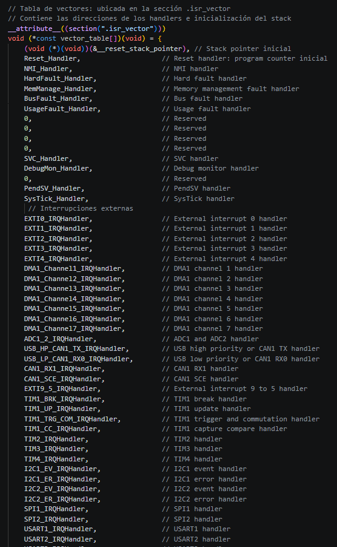

---

#### Sección .data en linker

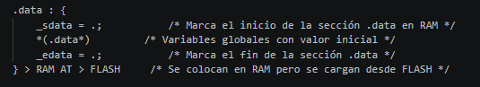

---

### Explicación del arranque

El `Reset_Handler` es la primera función que se ejecuta luego de un reset del microcontrolador.

Su función principal es inicializar el entorno de ejecución antes de llamar a `main()`. Para ello:

- Copia la sección `.data` desde FLASH a RAM, asegurando que las variables inicializadas tengan su valor correcto.
- Inicializa en cero la sección `.bss`, correspondiente a variables no inicializadas.
- Finalmente, llama a la función `main()`, donde comienza la lógica del programa.

De esta forma, se garantiza que el sistema esté correctamente preparado antes de ejecutar el código principal.

---

## 4. Ejecución Normal

### Compilación

```bash
make clean  //Para limpiar los binarios generados
make        //Para generar los binarios desde el main y el startup
```

### Uso de memoria

Ejecutar:

```bash
make size
```

Captura:

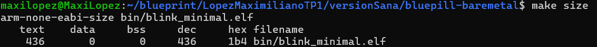

El programa ocupa 436 bytes de memoria FLASH (.text) y no utiliza memoria para variables inicializadas (.data) ni no inicializadas (.bss).

---

### Análisis del archivo `.map`

Se abrió el archivo generado en:

```
bin/blink_minimal.elf.map
```

Se agrupó las siguientes secciones para sacarles una screenshot:

- `.isr_vector`
- `.text`
- `.data`
- `.bss`

Captura:

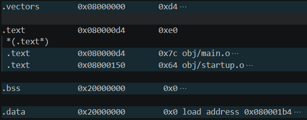

En el archivo `.map` se observa que:

- La sección `.vectors` se ubica al inicio de la memoria FLASH (0x08000000), donde el microcontrolador busca la tabla de vectores al arrancar
- La sección `.text`, que contiene el código ejecutable, se encuentra en FLASH a partir de la dirección 0x080000d4
- Las secciones `.data` y `.bss` se ubican en RAM (0x20000000)
- En este caso, tanto `.data` como `.bss` tienen tamaño 0, lo que indica que no hay variables globales utilizadas en el programa

---

### Explicación

- `.text`: contiene el código ejecutable
- `.data`: variables inicializadas, copiadas de FLASH a RAM
- `.bss`: variables no inicializadas, las cuales se inicializan en 0 durante la ejecucion
- `.isr_vector`: tabla de vectores de interrupción

---

## 5. Falla A — Vector Table Incorrecta

### Modificación realizada

Se modificó la ubicación de la vector table en el archivo `linker.ld`.
De la siguiente manera
```ld
.vectors 0x08001000 : {
    *(.isr_vector)
} > FLASH
```

---

### 📸 Evidencia

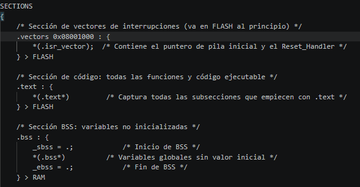

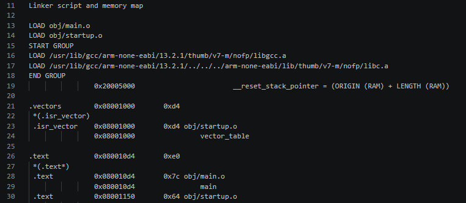

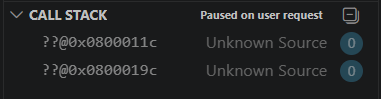

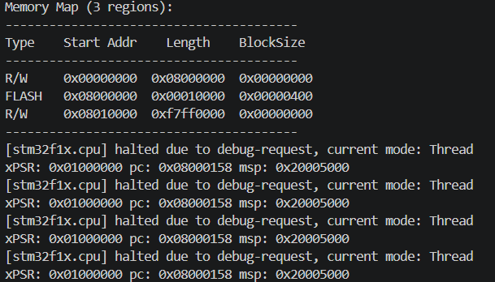


---

### Predicción

Al ejecutarlo, el microcontrolador no podrá encontrar correctamente el `Reset_Handler`, ya que la tabla de vectores no estará en la dirección esperada al inicio de la memoria FLASH.

---

### Resultado observado

Al ejecutar el programa con la vector table ubicada en una dirección incorrecta, el microcontrolador no logró seguir el flujo normal de arranque.

Se observó que:

el programa no alcanzó la función main
el LED no realizó el comportamiento esperado
al pausar la ejecución con el debugger, el contador de programa (PC) se encontraba en una dirección inesperada (0x08000158)
el debugger no pudo asociar la ejecución a ninguna función del código fuente, mostrando “unknown source”

Esto indica que el microcontrolador está ejecutando código fuera del flujo normal del programa.

Al producirse un reset, el microcontrolador lee la tabla de vectores desde la dirección base de la memoria FLASH (0x08000000).

En esta tabla se encuentran:

la dirección inicial del stack pointer
la dirección del Reset_Handler

Al modificar la ubicación de la sección .isr_vector en el linker la tabla de vectores deja de estar en la dirección esperada por el hardware.

Como consecuencia, el microcontrolador intenta leer direcciones inválidas o basura desde 0x08000000, lo que provoca que no pueda saltar correctamente al Reset_Handler. El microcontrolador carga direcciones incorrectas y comienza a ejecutar instrucciones desde una ubicación inválida o inesperada.

Esto provoca que el flujo de ejecución no alcance nunca la función main, y que el debugger no pueda asociar el programa en ejecución con el código fuente, resultando en el estado “unknown source”.

En la versión sana, el debugger se posiciona correctamente en main, mientras que en la versión defectuosa no logra hacerlo.

A diferencia de otras fallas, este error no siempre produce un HardFault inmediato, sino que puede derivar en ejecución de código inválido, dificultando su diagnóstico

---

### Corrección

Restaurar la ubicación original de `.vectors` en el linker.

---

## 6. Falla B — Inicialización incorrecta de `.data`

### 🔧 Modificación realizada

Se modificó la copia de `.data` en `startup.c`.

Ejemplo incorrecto:

```c
uint32_t *src = &_sdata; // incorrecto
```

---

### 📸 Evidencia

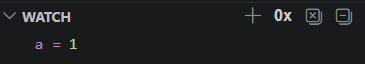

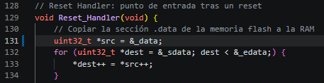
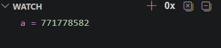


---

### Predicción

Las variables inicializadas no recibirán sus valores correctos, ya que no se copiarán desde FLASH a RAM correctamente.

---

### Resultado observado

Actualmente el programa no utiliza la seccion .data, por lo que se agregó una variable para visibilizar esta modificacion.

Se le añadió

```c
uint32_t a = 1;
```

La variable contiene valores incorrectos o basura. Que se puede apreciar en la ultima screenshot en evidencia, que constrasta con la primera screenshot que es la version sin error en el startup. Se puede ver como el valor de la variable a pasa de 1 a 771778582, es decir un valor que no se corresponde con el valor inicial definido en el código.

Las variables globales inicializadas se almacenan inicialmente en memoria FLASH como parte del binario, pero deben ser copiadas a RAM antes de ser utilizadas durante la ejecución.

Esta copia es realizada por el Reset_Handler en el archivo startup.c, utilizando un puntero de origen (en FLASH) y uno de destino (en RAM).

Al modificar incorrectamente el puntero de origen se pierde la referencia a la dirección en FLASH donde se encuentran los valores iniciales.

Como resultado, no se realiza la copia correcta de .data, y las variables en RAM quedan con valores residuales o indefinidos.

En el archivo .map se observa que la sección .data posee una dirección de carga en FLASH (LMA) y una dirección de ejecución en RAM (VMA), lo que confirma la necesidad de la copia realizada por el startup.

---

### Corrección

Restaurar:

```c
uint32_t *src = &_load_address;
```

---

## 7. Falla C — Configuración incorrecta de RAM

### Modificación realizada

Se modificó el tamaño de RAM en `linker.ld`.

Ejemplo:

```ld
RAM (rwx) : ORIGIN = 0x20000000, LENGTH = 800
```

---

### 📸 Evidencia

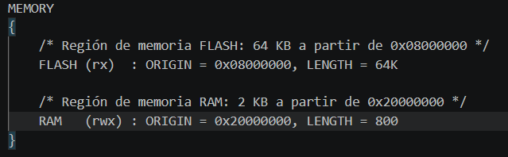  

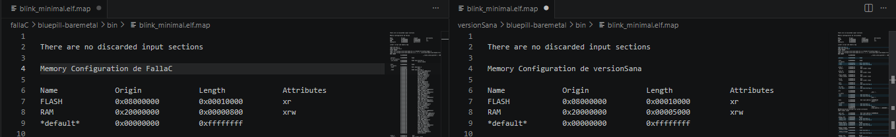

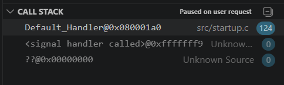


---

### Predicción

Puede producirse:

- falta de memoria
- corrupción de datos
- comportamiento errático

---

### Resultado observado

Inicialmente, el programa continuó funcionando correctamente a pesar de la reducción del tamaño de la RAM en el linker.

Esto se debe a que el programa no utiliza variables globales ni estructuras que requieran memoria significativa, por lo que el uso real de RAM es muy bajo y se encuentra dentro del límite de 800 bytes definido.

El cambio realizado afecta únicamente la percepción de memoria del linker durante la compilación, pero no modifica la memoria física disponible en el microcontrolador.

Por lo tanto, mientras el programa no exceda el tamaño de RAM definido en el linker, podrá ejecutarse sin inconvenientes.

Este comportamiento evidencia que los errores en el linker script no siempre generan fallas inmediatas, sino que dependen del uso real de memoria del programa.

Dado que la modificación inicial no generó una falla observable, se procedió a forzar un uso intensivo del stack mediante la incorporación de una función con variables locales de gran tamaño:

```main
void consumir_stack(void)
{
    // 1 KB en stack (más grande que tu RAM definida)
    volatile uint8_t buffer[1024];

    for (int i = 0; i < 1024; i++)
    {
        buffer[i] = i;
    }
}
```
Esta función fue llamada dentro del bucle principal.

Tras esta modificación, el programa dejó de comportarse de manera estable.

Se observaron síntomas como:

* detención del parpadeo del LED
* entrada en estado de fallo (HardFault)

En la seccion evidencia se adjuntó la screenshot de la falla que reportó el debugger

Esto se debe a que el stack crece dinámicamente en la memoria RAM durante la ejecución. Al reducir artificialmente la región de RAM disponible en el linker, el espacio efectivo para el stack se vuelve insuficiente.

La función agregada consume más memoria de la disponible, provocando que el stack sobrescriba otras regiones de memoria, lo que genera corrupción de datos o fallos de ejecución.

A diferencia de la falla B, esta falla depende del comportamiento dinámico del programa, por lo que puede manifestarse de forma no determinista y resultar más difícil de diagnosticar.

---

###  Corrección

Restaurar tamaño original de RAM:

```ld
LENGTH = 20K
```

---

##  8. Conclusión

Se pudo observar que el proceso de arranque en sistemas embebidos no depende únicamente del código en `main`, sino de una secuencia previa crítica definida por el hardware y el entorno de ejecución.

El linker establece la organización de la memoria, mientras que el startup es responsable de preparar el entorno necesario para que el lenguaje C funcione correctamente, incluyendo la inicialización de `.data` y `.bss`.

A través de las fallas inducidas, se evidenció que errores en estas etapas pueden impedir completamente la ejecución del programa o generar comportamientos erráticos difíciles de diagnosticar.

En particular, se comprendió que:

* la ubicación de la vector table es crítica para el inicio del sistema
* la correcta copia de .data es esencial para la coherencia de las variables
* el uso de memoria dinámica (stack) puede generar fallas no deterministas si no se controla adecuadamente

Esto demuestra que el comportamiento del sistema está fuertemente condicionado por la configuración de memoria y el código de arranque, incluso antes de que se ejecute la lógica principal del programa.
